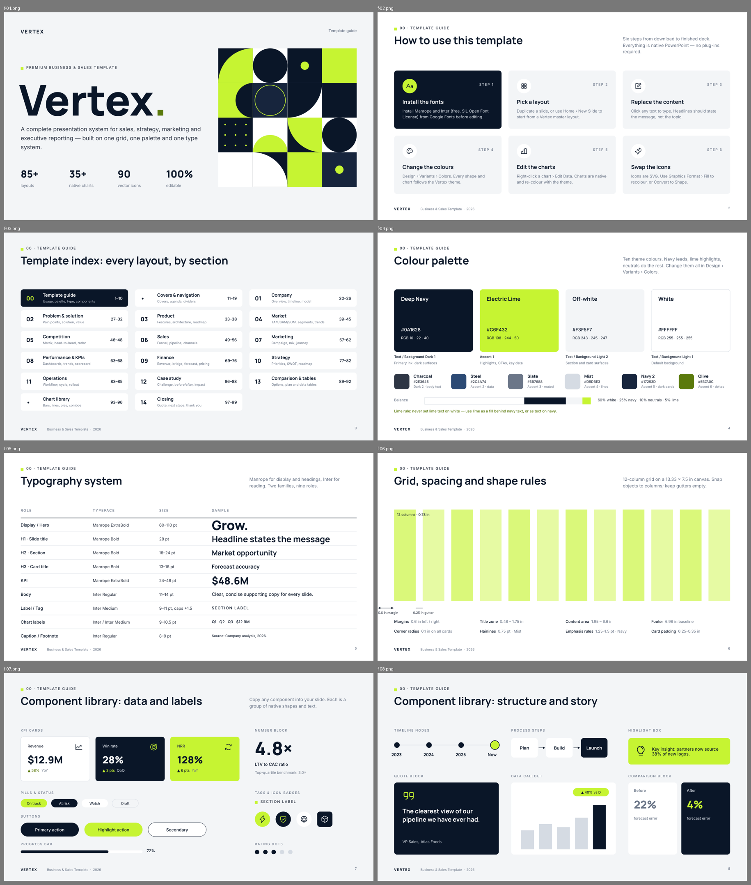
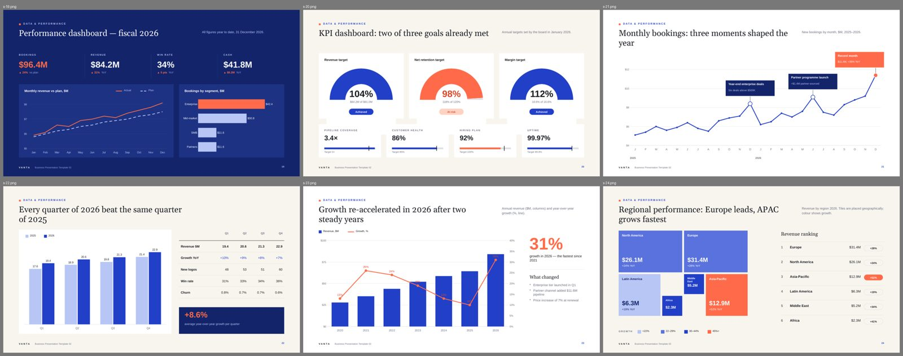

# Vertex — Premium Business & Sales PowerPoint Template

A 99-slide, fully editable PowerPoint template system for sales, marketing, consulting, startup and executive presentations. It has a light, white-first look, one brand system and no photography.

**File:** `Vertex_Premium_Business_Sales_Template_FIXED.pptx` (16:9, 13.33 × 7.5 in)



## What's inside

| # | Section | Slides |
|---|---|---|
| 00 | Template guide: how to use, index, palette, typography, grid, components, icons, chart guidance | 1–10 |
| • | Covers (5) & navigation: agenda, contents, divider, chapter intro | 11–19 |
| 01 | Company | 20–26 |
| 02 | Problem & solution | 27–32 |
| 03 | Product | 33–38 |
| 04 | Market | 39–45 |
| 05 | Competition | 46–48 |
| 06 | Sales | 49–56 |
| 07 | Marketing | 57–62 |
| 08 | Performance & KPIs | 63–68 |
| 09 | Finance | 69–76 |
| 10 | Strategy | 77–82 |
| 11 | Operations / process | 83–85 |
| 12 | Case study | 86–88 |
| 13 | Comparison & tables | 89–92 |
| • | Chart library | 93–96 |
| 14 | Closing | 97–99 |

- **37 native PowerPoint charts**: bar, column, clustered, stacked, 100% stacked, line, area, stacked area, combo (column + line), doughnut, pie, radar, bubble and a waterfall built from stacked columns. Right-click › Edit Data works on every one.
- **Native tables** for the KPI scorecard, forecast, plan comparison and P&L.
- **Diagrams built from shapes**: funnels, Gantt, treemap, Harvey balls, bullet charts, cycle, hub-and-spoke, tree, Ansoff, SWOT, positioning matrix and the strategy house.
- **90 vector icons** from Phosphor (Regular weight, MIT licence), embedded as SVG with a PNG fallback. Recolour them with Graphics Format › Fill, or use Convert to Shape.
- **Speaker notes** on every slide explain the layout and how to edit it.

## Design system

### Colour (theme: "Vertex")
Every shape, text run and chart series points at a theme slot, so **Design › Variants › Colors** recolours the whole template at once.

| Slot | Name | HEX | Role |
|---|---|---|---|
| Dark 1 | Deep Navy | `#0A1628` | Primary ink, dark surfaces |
| Light 1 | White | `#FFFFFF` | Default background |
| Dark 2 | Charcoal | `#2E3645` | Body text |
| Light 2 | Off-white | `#F3F5F7` | Cards and section surfaces |
| Accent 1 | Electric Lime | `#C6F432` | Highlights, CTAs, key data |
| Accent 2 | Steel | `#2C4A74` | Secondary data |
| Accent 3 | Slate | `#6B7688` | Muted text, tertiary data |
| Accent 4 | Mist | `#D5DBE3` | Hairlines, inactive data |
| Accent 5 | Navy 2 | `#17253D` | Raised surfaces on navy |
| Accent 6 | Olive | `#5B7A0C` | Positive deltas on light |

Lime rule: never set lime text on white. Use lime as a fill behind navy text, or as text on navy.

### Typography
Theme fonts are set to **Manrope** (headings) and **Inter** (body). Both are free under the SIL Open Font License from Google Fonts. Install both before editing. The weights "Manrope ExtraBold" and "Inter Medium" are separate font families in PowerPoint.

| Role | Font | Size |
|---|---|---|
| Display / hero | Manrope ExtraBold | 60–110 pt |
| H1 slide title | Manrope Bold | 28 pt |
| H2 / H3 | Manrope Bold | 13–24 pt |
| KPI | Manrope ExtraBold | 24–48 pt |
| Body | Inter | 11–14 pt |
| Label / tag | Inter Medium, caps, +1.5 spacing | 9–11 pt |
| Chart labels | Inter / Inter Medium | 9–10.5 pt |
| Footnote | Inter | 8–9 pt |

### Grid
12 columns (0.78 in wide) · 0.25 in gutters · 0.6 in side margins · content area 1.95–6.6 in · 0.1 in corner radius · 0.75 pt hairlines.

### Slide masters
Content Light, Content Off-white, Content Dark (each with a title placeholder, footer and slide number), Blank Light, Blank Dark and Blank White.

## Compatibility
The package passes strict ISO/IEC 29500 schema validation for every slide, layout, master, notes part, chart, theme and presentation part, plus OPC validation of `[Content_Types].xml` and all relationship parts. That's the level of strictness PowerPoint for Android/iOS expects. `generator/sanitize.py` fixes known pptxgenjs output defects at build time:

- `[Content_Types].xml` overrides for slide masters that don't exist
- duplicate shape IDs on slides
- `<a:pPr>` emitted after text runs
- chart elements out of schema order, dangling axis IDs and missing `<c:grouping>`
- `notesMasterIdLst` out of order, and a notes master sharing the slide master's theme

## Rebuilding from source
The template is generated from code in `generator/` using pptxgenjs. `post.py` then rewrites brand colours as theme references, attaches the SVG icons and runs `sanitize.py` for schema conformance.

```bash
cd generator && npm install && node build.js   # writes out/Vertex — ….pptx (requires python3 + lxml)
```

---

# Vanta — Business Presentation Template 02

A second product in the same design family: 60 fully editable 16:9 slides in a cobalt / coral / ivory palette, with editorial Georgia headlines and Arial body text. It has no photography.

**Files** (in `template02/`):
- `Vanta_Business_Presentation_Template_02.pptx`: the template
- `Vanta_Business_Presentation_Template_02_Guide.pdf`: a 10-page guide covering editing, fonts, palette, charts, components, recommended usage and a thumbnail index



## What's inside
| Chapter | Slides |
|---|---|
| Introduction: cover, statement, agenda, executive overview, key numbers | 1–5 |
| Company context: snapshot, growth, business model, revenue streams, opportunity | 6–10 |
| Market & analysis: size, growth, segmentation, share, landscape, competitors, positioning, benchmarks | 11–18 |
| Data & performance: dashboards, monthly/quarterly/YoY, regions, products, ranking, target vs actual, variance | 19–28 |
| Sales: funnel, pipeline, conversion, channels, forecast, territories, acquisition, retention | 29–36 |
| Finance: revenue mix, profitability, expenses, margins, cash flow, waterfall, forecast | 37–43 |
| Strategy: priorities, SWOT, roadmap, growth levers, opportunity matrix, risk matrix, action plan | 44–50 |
| Product & marketing: modules, comparison, pricing, features, marketing funnel, campaign dashboard | 51–56 |
| Results & close: case study, before/after, takeaways, closing | 57–60 |

- **42 native PowerPoint charts** on 36 slides, each with an embedded worksheet: column, bar, stacked, 100% stacked, line, dashed-plan line, area, stacked area, column + line and area + line combos on secondary axes, doughnut gauges, pie, radar, scatter, bubble, a centred funnel and a waterfall.
- **Five dashboards**: executive (19), KPI (20), sales pipeline (30), financial (38–41) and marketing campaign (56).
- **Theme colours**: Ink, White, Deep Cobalt, Ivory, Cobalt `#2340C8`, Coral `#FF6B4A`, Sky, Mist, Stone, Peach. **Theme fonts**: Georgia + Arial. Both are pre-installed on Windows, macOS, iOS and Android Office.
- **Five slide masters**: Ivory, White and Cobalt (each with a title placeholder, footer and slide number), plus Blank Ivory and Blank Cobalt.
- **32 Phosphor Light vector icons**, embedded as SVG with a PNG fallback.
- **Speaker notes** on every slide.

## Rebuilding
```bash
cd template02/generator && npm install && node build.js   # writes out/Vanta_Business_Presentation_Template_02.pptx
```
`post.py` maps colours to theme slots and attaches the icons. `sanitize.py` then applies the same strict-schema fixes as Template 01. It also drops empty cached chart points, which are the blank cells in the highlight series. `guide/guide.py` builds the guide HTML (printed with headless Chromium) from a rendered QA pass.
